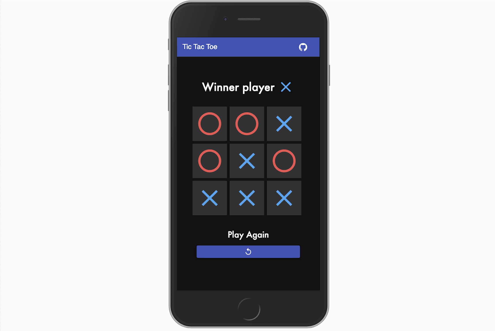

# Tic Tac Toe Game

This web app it's a personal version of the famous Tic Tac Toe game, made with [React](https://reactjs.org/). With this application you will be able to play with another person in the same device.
This project it's with educational purpose in order to learn and improve my own React skills, therefore it is not an application for profit or to create a valid product for a production environment.



# Demo

You can play Tic Tac Toe from the following [demo](https://tic-tac-toe-fb71e.web.app/).

## Getting Started

These instructions will get you a copy of the project up and running in your local machine for development and testing purposes.a

## Installing Dependences

A step by step series of examples that tell you how to get a development env running.

Install dependences with yarn

```
yarn install
```

## Started
Runs the app in development mode:
Open http://localhost:3000 to view it in the browser.Started

```
yarn start
```
